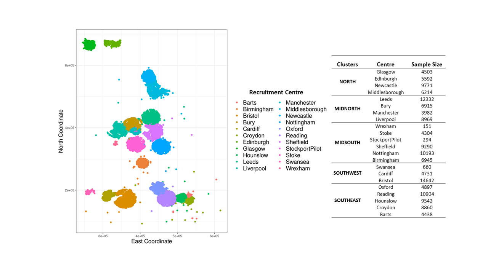
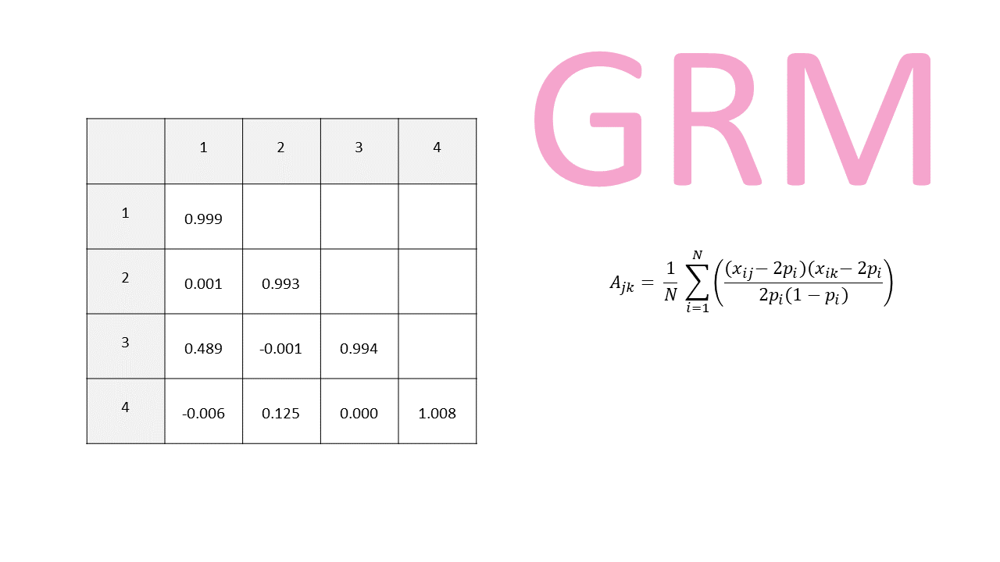
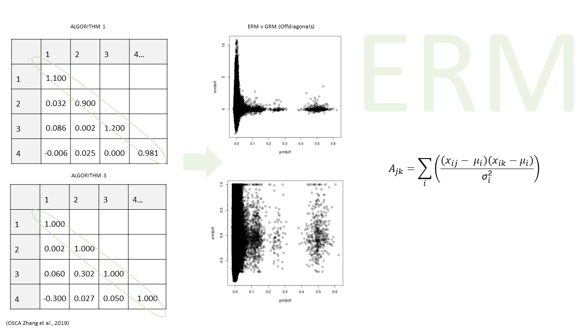
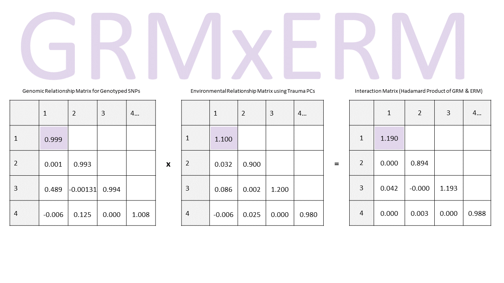
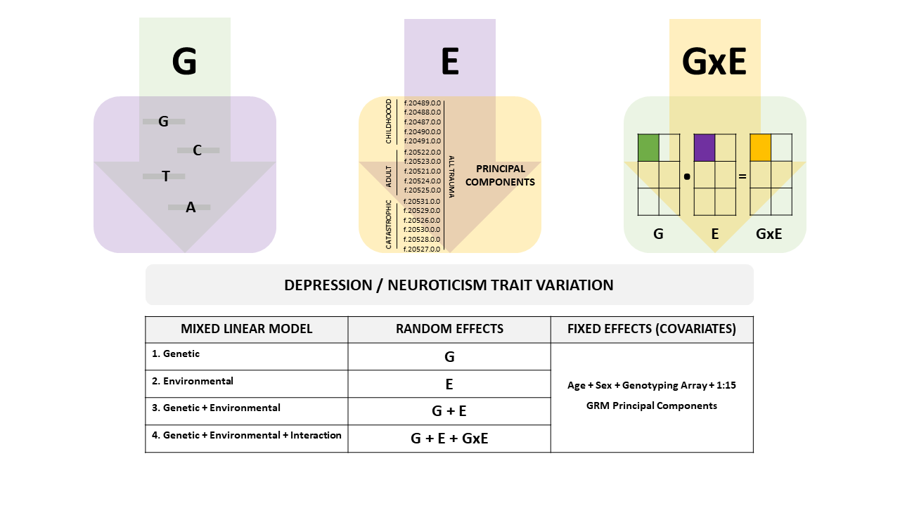
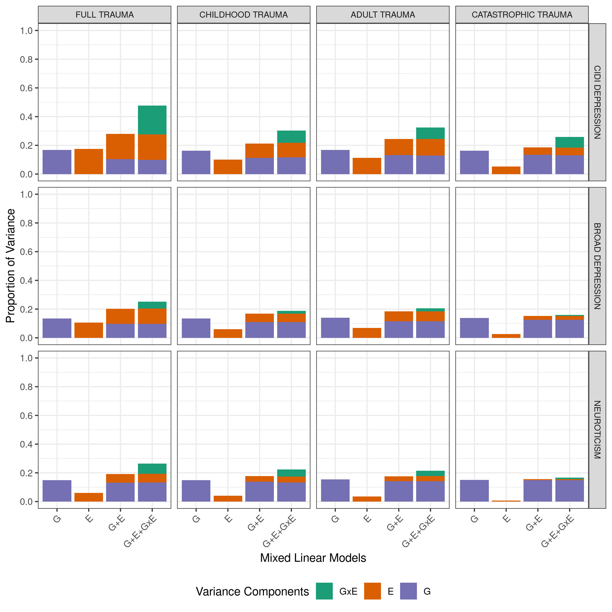
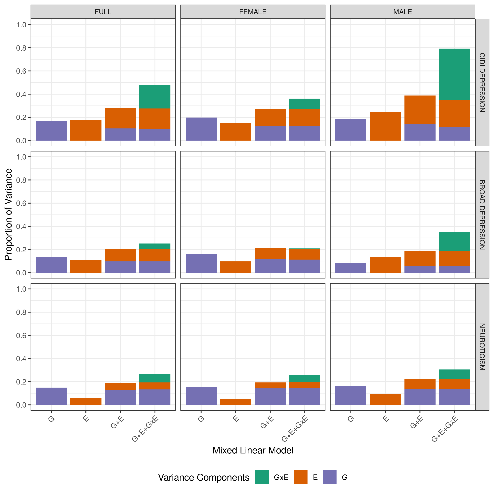

# Gene Environment Interaction Effects in Depression  

Recent methods exploring GxE effects in depression include genome-wide by environment studies (GWEIS) and PGS by envrionment studies.
Findings from these methods have yielded inconsistent and negligible evidence of GxE effects in depression (Peyrot et al., 2014; Peyrot et al., 2018; Mullins et al., 2016; Coleman et al., 2020; Arnau-Soler et al., 2018; Arnau-Soler et al., 2019).

This is likely due to PGSs and genome-wide variants not capturing much of the genetic variance observed in the highly polygenic and complex trait; depression.

Here we employ a mixed linear method making use of relationship matrices capturing genetic, environmental and genome-by-environment interaction effects.  

The genomic relationship matrices (GRMs) utilise all available genotyped SNPs and thus, are better measures of genetic variance in comparison to single genome-wide variants and PGSs. We expect this model to yield greater statistical power when exploring GxE effects.  

In this study we are interested in Genome-by-Trauma Exposure interaction effects. We use available genomic and trauma exposure data from the UKB study. 

# Relationship Matrices  

We have a realtively large sample with available genomic and trauma data ~150k, so this would mean we would be creating 150k by 150k matrices. This is not too difficult to compute, however, including these matrices into MLMs (downstream analyses) would be computationally exhaustive.  
So here, I create sub-samples based on geographical location of participants (geographical clusters).

Clusters: 
  

## Genomic Relationship Matrices (GRMs)  

GRMs represent pair-wise genomic similarity between individuals within the sample.  
The equation calculating genomic similarity incorporates information on the MAF of alleles and the number of copies each individual has. 

Equation: 

With A_jk being the genomic similarity between individuals j and k. Where N is the total number of SNPs; x_ij and x_ik are the number of copies of the reference allele for the ith SNP in individual j and k respectively; p_i is the frequency of the reference allele.

A matrix is formed using GCTA software, where diagonals represent genomic similarity of individuals with themselves (so we expect this to be ~1), and offdiagonals represent pairwise genomic similarities. The offdiagonals can also signify relatedness, e.g. parent/offspring or siblings are likely to exhibit values ~0.5, cousins ~0.125 etc.  

## Environmental Relationship Matrices (ERMs)  

ERMs represent pair-wise trauma exposure similarity between individuals within the sample.  
Remember, the environmental variable can represent any variable of interest. In this study we are interested in self-reported trauma exposure.  

16 questions are available assessing self-reported trauma exposure, these are split into 3 groups capturing childhood, adult and catastrophic trauma. To incorporate this information coherently, we utilise the principal components of the available questions.

Matrices are formed used OSCA software, where diagonals represent trauma exposure similarity of individuals with themselves, and offdiagonals represent pairwise trauma exposure similarities. 
This is based on the how similar the PC values are between each individual. 
OSCA has three algorithms to calculate similarity between two individuals using the trauma exposure principal components. Algorithm 2 is irrelevant to our data. 
Results MLM including ERMs computed using algorithm 1 vs 3 show negligible differences.

Algorithm 1 results in matrices with diagonals that average to 1. Algorithm 3 results in matrices with diagonal values of 1. The offdiagonals of the ERMs are plotted against the offdiagonals of GRMs. 
We chose to use the default algorithm 1 going forward. 

We create different ERMs for full trauma (using PCs of all 16 trauma questions), childhood trauma (using PCs of only childhood trauma questions), adult trauma (using PCs of only adult trauma questions) and catastrophic trauma (using PCs of only catastrophic trauma questions). 

## Interaction Relationship Matrices (GxE)  

We create matrices representing pairwise genome-by-trauma interaction effect similarity between individuals within the sample. We create the GxE matrices using matrix algebra. Mathematically an interaction effect can be thought of as a multiplication, so we obtain the hadamard product of GRM and available ERMs. To be able to use the hadarmard product, matrices have to have identical components, so here we use participants with COMPLETE data.  

Matrix:

# Mixed Linear Models  

Four different MLMs are conducted with increasing complexity, incorporating the created relationship matrices as random effects within GCTA using a GREML framework.  

Equations:  

# Findings

Our findings uncovered statistically significant CIDI depression heritability estimates of 0·16 [SE 0·016]. Subtypes of self-reported trauma exposure accounted for a significant proportion of CIDI depression variance ranging from 0·05 [SE 0·013] to 0·18 [SE 0·025]. The proportion of variance accounted for by significant genome-by-trauma interaction variance estimates ranged from 0·074 [SE 0·006] to 0·201 [SE 0·009].  

Estimates are attenuated for broad depression and neuroticism.  
  

The magnitude of genome-by-trauma interaction effects were found to be greatly different between males and females.  
  

